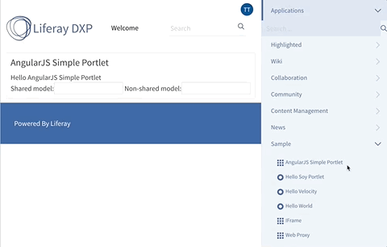

# AngularJS Portlet [](id=angularjs-portlet)

## What does this sample do when it's deployed? [](id=what-does-this-sample-do-when-its-deployed)

This example demonstrates how to integrate AngularJS (v1.x) with Liferay, providing it as an instantiable portlet.



## What API(s) and/or code components does this sample highlight? [](id=what-apis-and-or-code-components-does-this-sample-highlight)

This sample leverages the customization by
[overring core JSPs](https://dev.liferay.com/develop/tutorials/-/knowledge_base/7-0/overriding-core-jsps).

## How does this sample leverage the API(s) and/or code component? [](id=how-does-this-sample-leverage-the-apis-and-or-code-component)

This sample is based on two projects:

- [angularjs-hook](angularjs-hook): Loads AngularJS globally by overring core JSPs. To achieve that, the file [top_js-ext.jspf](angularjs-hook/src/main/resources/META-INF/jsps/html/common/themes/top_js-ext.jspf) ensures the right place to add the AngularJS framework.
- [angularjs-simple-portlet](angularjs-simple-portlet): An example to demonstrate how to use AngularJS in a portlet, and making it instantiable.

The [angularjs-hook](angularjs-hook) project provides a function to load bootstrap an AngularJS portlet. The following piece of code contains the bootstrap phase. Each portlet will be instantiable because it will be loaded using portletId as its [AngularJS module name](https://docs.angularjs.org/api/ng/function/angular.module).

```javascript
...
angular.portlet.add = function(portletName, angularFunction) {
  angularPortlets[portletName] = angularFunction;
};

  Liferay.Portlet.ready(function(portletInstanceId, node) {

  var idx = portletInstanceId.indexOf('_INSTANCE_'); 
  var portletName = portletInstanceId.substring(0, idx);

  if (angularPortlets[portletName]) {

    var portletId = portletInstanceId.substring(idx).replace('_INSTANCE_', '');

    angular.bootstrap(node.getDOMNode(), angularPortlets[portletName](
		  portletId, node.getDOMNode()));
    }
  });
})(Liferay, angular);
```

A [SharedService](angularjs-hook/src/main/resources/META-INF/resources/js/main.js#L29) module is also provided on it to allows shared models between AngularJS portlets, the following code demonstrates an input shared in any module that reuses the same model.

A model as a shared object:

```javascript
$scope.sharedModel = function(value) {
			if (angular.isDefined(value)) {
			  SharedService.change('sharedModel', value)
			} else {
			  return SharedService.get().sharedModel
      }
``` 

A shared model as an input field:     

```html
<span>Shared model:</span>
<input ng-model="sharedModel" ng-model-options=" {getterSetter: true } "></input>

```

## Where Is This Sample? [](id=where-is-this-sample)

There are three different versions of this sample, each built with a different
build tool:

- [Gradle](https://github.com/liferay/liferay-blade-samples/tree/master/gradle/apps/angularjs)
- [Liferay Workspace](https://github.com/liferay/liferay-blade-samples/tree/master/liferay-workspace/apps/angularjs)
- [Maven](https://github.com/liferay/liferay-blade-samples/tree/master/maven/apps/angularjs)